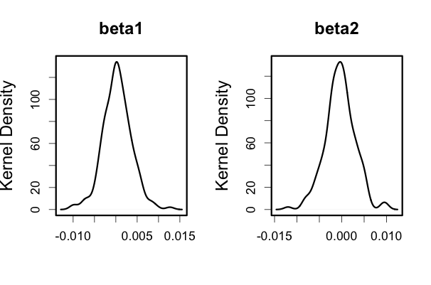
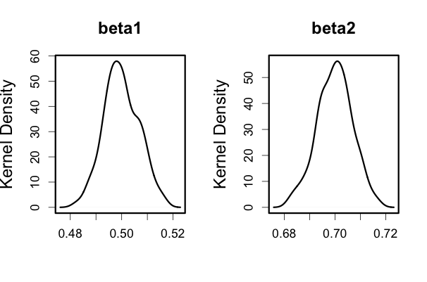

[](http://quantlet.de/)

## [](http://quantlet.de/) **BQPR_betadensity** [](http://quantlet.de/)

```yaml

Name of Quantlet : BQPR_betadensity

Published in : Balanced Quantile Predictive Regression

Description : 'Plots the kernel density of the coefficients estimated in BQPR model in simulation,
which is consistent and asymptotically follows normal distribution.'

Keywords : simulation, asymptotic, quantile regression, nonstationary, kernel

Author [New] : Xiaosai Liao

Submitted : Tue, February 2 2016 by Chen Huang

Example : There are two examples with different parameter settings.

```






### R Code:
```r

## clear history
rm(list = ls(all = TRUE))
graphics.off()

## install and load packages
libraries = c("quantreg", "mvtnorm", "plyr", "KernSmooth", "rootSolve")
lapply(libraries, function(x) if (!(x %in% installed.packages())) {
    install.packages(x)
})
lapply(libraries, library, quietly = TRUE, character.only = TRUE)

## setting the parameters
mytau = c(0.05, 0.5)
c     = c(2, 4)
r     = c(0.5, 0.7)
bet0  = 1
bet1  = c(0, 0.5)
bet2  = c(0, 0.7)
sigma = c(0.1, 0.2)
n     = 1000  # the sample size
nsim  = 200  # the times of repeats in simulation
beta1 = rep(0, nsim)  # the estimator of bet1
beta2 = rep(0, nsim)  # the estimator of bet2

## suitation1 data generate
for (i in 1:nsim) {
    alpha    = 1 - c[1]/n^r[1]
    xstar    = arima.sim(model = list(ar = c(alpha)), n + 3, sd = 2)
    m        = as.matrix(cbind(xstar[3:(n + 2)], xstar[2:(n + 1)]))
    beta     = as.matrix(c(bet1[1], bet2[1]))
    y        = bet0 + m %*% beta + rnorm(n, 0, sigma[1])
    I        = rep(1, n)
    x        = rnorm(n, 0, 2)
    
    
    ## estimate bet1
    fit      = rq(formula = y ~ cbind(m, xstar[1:n]), tau = mytau[1])
    temp     = coef(fit)
    beta1[i] = temp[[2]]
    beta2[i] = temp[[3]]
}

## estimate the denstiy of the estimator
d1 = density(beta1)
d2 = density(beta2)
attach(mtcars)
par(mfrow = c(1, 2))
plot(d1, main = "beta1", ylab = "Kernel Density", xlab = "")
plot(d2, main = "beta2", ylab = "Kernel Density", xlab = "")

## suitation2
for (i in 1:nsim) {
    alpha    = 1 - c[2]/n^r[2]
    xstar    = arima.sim(model = list(ar = c(alpha)), n + 3, sd = 2)
    m        = as.matrix(cbind(xstar[3:(n + 2)], xstar[2:(n + 1)]))
    beta     = as.matrix(c(bet1[2], bet2[2]))
    y        = bet0 + m %*% beta + rnorm(n, 0, sigma[2])
    I        = rep(1, n)
    x        = rnorm(n, 0, 2)
    
    
    ## estimate bet1
    fit      = rq(formula = y ~ cbind(m, xstar[1:n]), tau = mytau[1])
    temp     = coef(fit)
    beta1[i] = temp[[2]]
    beta2[i] = temp[[3]]
}

## estimate the denstiy of the estimator
d1 = density(beta1)
d2 = density(beta2)
attach(mtcars)
par(mfrow = c(1, 2))
plot(d1, main = "beta1", ylab = "Kernel Density", xlab = "")
plot(d2, main = "beta2", ylab = "Kernel Density", xlab = "") 

```
